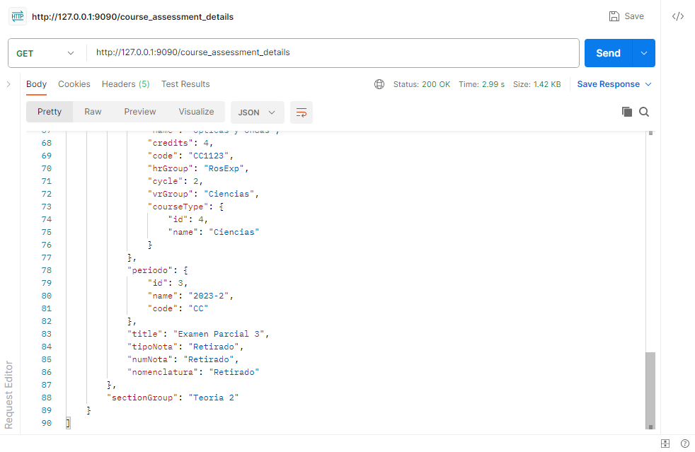
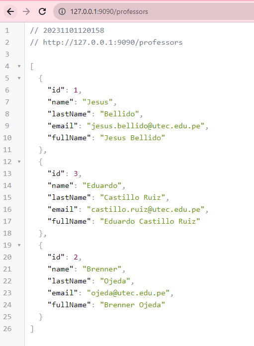
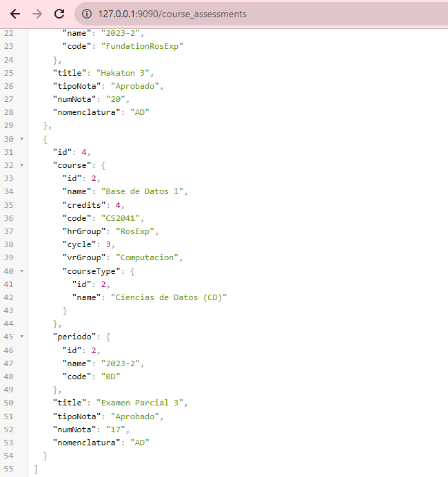

# Hackatón

# CourseAssessmentDetails
---
```http://127.0.0.1:9090/course_assessment_details```

```
{
    "score" : "20",
    "section" : "Auditorio",
    "sectionGroup": "Teoria 1",
    "courseAssessment":{
    "id":1,
    "course":{    
    "id":1,
    "name": "Desarrollo Basado en Plataformas",
    "credits":4,
    "code" : "CS2031",
    "hrGroup":"RosExp",
    "cycle": 3,
    "vrGroup": "Computacion",
    "courseType": {
        "id": 1,
        "name" :"Ciencias de la Computacion"
    }

    },

    "periodo":{
        "id":1,
        "code":"FundacionRosExp",
        "name":"2023"
    },
    "title":"Hakaton 3",
    "tipoNota":"Aprobado",
    "numNota": "20",
    "nomenclatura":"AD"
    },

    "professor":{
        "id":1,
        "name": "Jesus",
        "lastName": "Bellido",
        "email":"jesus.bellido@utec.edu.pe",
        "fullName":"Jesus Bellido"

    },

    "student":{
        "id":1,
        "name": "Gian Marco",
        "email": "gian.arteaga@utec.edu.pe",
        "code": "202120094"
    }
}
```


```
{
    "score" : "Retirado",
    "section" : "A707 - A708",
    "sectionGroup": "Teoria 2",
    "courseAssessment":{
    "id":5,
    "course":{    
    "id":3,
    "name": "Opticas y Ondas",
    "credits":4,
    "code" : "CC1123",
    "hrGroup":"RosExp",
    "cycle": 2,
    "vrGroup": "Ciencias",
    "courseType": {
        "id": 4,
        "name" :"Ciencias"
    }
    },

    "periodo":{
    "id":3,    
    "name": "2023-2",
    "code": "CC"
    },
    "title":"Examen Parcial 3",
    "tipoNota":"Retirado",
    "numNota": "Retirado",
    "nomenclatura":"Retirado"
    },

    "professor":{
        "id":3,
        "name": "Eduardo",
        "lastName": "Castillo Ruiz",
        "email":"castillo.ruiz@utec.edu.pe",
        "fullName":"Eduardo Castillo Ruiz"

    },

    "student":{
        "id":3,
        "name": "Gian Marco",
        "email": "gian.arteaga@utec.edu.pe",
        "code": "202120094"
    }
}
```




```
{
    "score" : "17",
    "section" : "A904",
    "sectionGroup": "Teoria 1",
    "courseAssessment":{
    "id":4,
    "course":{    
    "id":2,
    "name": "Base de Datos I",
    "credits":4,
    "code" : "CS2041",
    "hrGroup":"RosExp",
    "cycle": 3,
    "vrGroup": "Computacion",
    "courseType": {
        "id": 2,
        "name" :"Ciencias de Datos"
    }

    },

    "periodo":{
        "id":2,
        "code":"FundacionRosExp",
        "name":"2023"
    },
    "title":"Examen Final",
    "tipoNota":"Aprobado",
    "numNota": "17",
    "nomenclatura":"AD"
    
    },

    "professor":{
    "id": 2,
    "name": "Brenner",
    "lastName": "Ojeda",
    "email": "ojeda@utec.edu.pe",
    "fullName": "Brenner Ojeda"
},

    "student":{
        "id":2,
        "name": "Gian Marco",
        "email": "gian.arteaga@utec.edu.pe",
        "code": "202120094"
    }
}
```


---
# Professor

---
```http://127.0.0.1:9090/professors```
```
{
    "name": "Jesus",
    "lastName": "Bellido",
    "email":"jesus.bellido@utec.edu.pe",
    "fullName":"Jesus Bellido"
}
```
```
{
    "id": 3,
    "name": "Eduardo",
    "lastName": "Castillo Ruiz",
    "email": "castillo.ruiz@utec.edu.pe",
    "fullName": "Eduardo Castillo Ruiz"
}
```

```
{
    "id": 2,
    "name": "Brenner",
    "lastName": "Ojeda",
    "email": "ojeda@utec.edu.pe",
    "fullName": "Brenner Ojeda"
}
```



---


# Student
---
```http://127.0.0.1:9090/students```
```
{
    "name": "Gian Marco",
    "email": "gian.arteaga@utec.edu.pe",
    "code": "202120094"
}
```


---

# CourseAssessment

---
```http://127.0.0.1:9090/course_assessments```
```
{

    "course":{    
    "id":1,
    "name": "Desarrollo Basado en Plataformas",
    "credits":4,
    "code" : "CS2031",
    "hrGroup":"RosExp",
    "cycle": 3,
    "vrGroup": "Computacion",
    "courseType": {
        "id": 1,
        "name" :"Ciencias de la Computacion"
    }

    },

    "periodo":{
        "id":1,
        "code":"FundacionRosExp",
        "name":"2023"
    },
    "title":"Hakaton 3",
    "tipoNota":"Aprobado",
    "numNota": "20",
    "nomenclatura":"AD"
    
}
```


```
{

    "course":{    
    "id":2,
    "name": "Base de Datos I",
    "credits":4,
    "code" : "CS2041",
    "hrGroup":"RosExp",
    "cycle": 3,
    "vrGroup": "Computacion",
    "courseType": {
        "id": 2,
        "name" :"Ciencias de Datos"
    }

    },

    "periodo":{
        "id":1,
        "code":"FundacionRosExp",
        "name":"2023"
    },
    "title":"Examen Parcial 3",
    "tipoNota":"Aprobado",
    "numNota": "17",
    "nomenclatura":"AD"
    
}
```




```
{

    "course":{    
    "id":3,
    "name": "Opticas y Ondas",
    "credits":4,
    "code" : "CC1123",
    "hrGroup":"RosExp",
    "cycle": 2,
    "vrGroup": "Ciencias",
    "courseType": {
        "id": 4,
        "name" :"Ciencias"
    }
    },

    "periodo":{
    "id":3,    
    "name": "2023-2",
    "code": "CC"
    },
    "title":"Examen Parcial 3",
    "tipoNota":"Retirado",
    "numNota": "Retirado",
    "nomenclatura":"Retirado"
    
}
```


---
# Periodo
---
```http://127.0.0.1:9090/periodos```
```
{    
    "name": "2023-2",
    "code": "FundationRosExp"
}
```


```
{    
    "name": "2023-2",
    "code": "BD"
}
```


```
{    
    "name": "2023-2",
    "code": "CC"
}
```


---


## Course
---
```http://127.0.0.1:9090/courses```
```
{    

    "name": "Desarrollo Basado en Plataformas",
    "credits":4,
    "code" : "CS2031",
    "hrGroup":"RosExp",
    "cycle": 3,
    "vrGroup": "Computacion",
    "courseType": {
        "id": 1,
        "name" :"Ciencias de la Computacion"
    }

}
```


```
{    

    "name": "Base de Datos I",
    "credits":4,
    "code" : "CS2041",
    "hrGroup":"RosExp",
    "cycle": 3,
    "vrGroup": "Computacion",
    "courseType": {
        "id": 2,
        "name" :"Ciencias de Datos"
    }

}
```


```
{    

    "name": "Opticas y Ondas",
    "credits":4,
    "code" : "CC1123",
    "hrGroup":"RosExp",
    "cycle": 2,
    "vrGroup": "Ciencias",
    "courseType": {
        "id": 4,
        "name" :"Ciencias"
    }

}
```


---

## CourseType
---
```http://127.0.0.1:9090/course_types```
```
{
    "name": "Ciencias de la Computacion (CS)"
}
```

```
{
    "name": "Ciencias de Datos (CD)"
}
```

```
{
    "name": "Opticas y Ondas"
}
```


---


