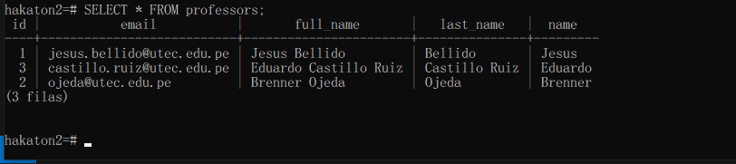
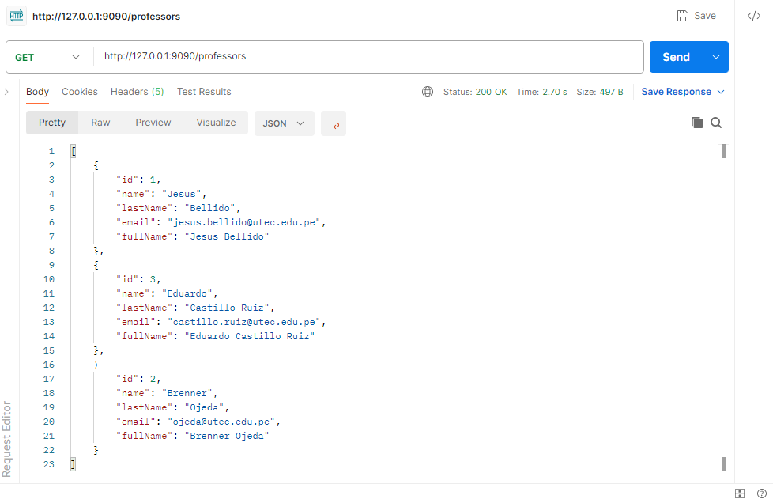
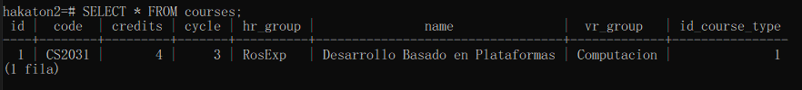
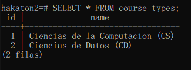

# Hackatón

# CourseAssessmentDetails
```
{
    "score" : "15",
    "section" : "A708",
    "sectionGroup": "Grupo 1",
    "courseAssessment":{
        "id":6,
        "periodo":{
            "id":1,
            "name": "2023-2",
            "code": "FundationRosExp"
        },
        "course":{ 
            "id":8, 
            "courseType":{
                "id": 1,
                "name" :"Ciencias"
            },

            "name": "Calculo 1",
            "credits":4,
            "code" : "CC2021",
            "hrGroup":"RosExp",
            "cycle": 1,
            "vrGroup": "1"
        },
        "title":"Prueba de Entrada",
        "tipoNota":"Aprobado",
        "numNota": "20",
        "nomenclatura":"AD"
    },

    "professor":{
        "id":1,
        "name": "Jesus",
        "lastName": "Bellido",
        "email":"jesus.bellido@utec.edu.pe",
        "fullName":"Jesus Bellido"

    },

    "student":{
        "id":1,
        "name": "Gian Marco",
        "email": "gian.arteaga@utec.edu.pe",
        "code": "202120094"
    }
}
```
# Professor

---
```http://127.0.0.1:9090/professors```
```
{
    "name": "Jesus",
    "lastName": "Bellido",
    "email":"jesus.bellido@utec.edu.pe",
    "fullName":"Jesus Bellido"
}
```



---


# Student
---
```http://127.0.0.1:9090/students```
```
{
    "name": "Gian Marco",
    "email": "gian.arteaga@utec.edu.pe",
    "code": "202120094"
}
```


---

# CourseAssessment

---
```http://127.0.0.1:9090/course_assessments```
```
{

    "course":{    
    "id":1,
    "name": "Desarrollo Basado en Plataformas",
    "credits":4,
    "code" : "CS2031",
    "hrGroup":"RosExp",
    "cycle": 3,
    "vrGroup": "Computacion",
    "courseType": {
        "id": 1,
        "name" :"Ciencias de la Computacion"
    }

    },

    "periodo":{
        "id":1,
        "code":"FundacionRosExp",
        "name":"2023"
    },
    "title":"Hakaton 3",
    "tipoNota":"Aprobado",
    "numNota": "20",
    "nomenclatura":"AD"
    
}
```


```
{

    "course":{    
    "id":2,
    "name": "Base de Datos I",
    "credits":4,
    "code" : "CS2041",
    "hrGroup":"RosExp",
    "cycle": 3,
    "vrGroup": "Computacion",
    "courseType": {
        "id": 2,
        "name" :"Ciencias de Datos"
    }

    },

    "periodo":{
        "id":1,
        "code":"FundacionRosExp",
        "name":"2023"
    },
    "title":"Examen Parcial 3",
    "tipoNota":"Aprobado",
    "numNota": "17",
    "nomenclatura":"AD"
    
}
```


```
{

    "course":{    
    "id":3,
    "name": "Opticas y Ondas",
    "credits":4,
    "code" : "CC1123",
    "hrGroup":"RosExp",
    "cycle": 2,
    "vrGroup": "Ciencias",
    "courseType": {
        "id": 4,
        "name" :"Ciencias"
    }
    },

    "periodo":{
    "id":3,    
    "name": "2023-2",
    "code": "CC"
    },
    "title":"Examen Parcial 3",
    "tipoNota":"Retirado",
    "numNota": "Retirado",
    "nomenclatura":"Retirado"
    
}
```


---
# Periodo
---
```http://127.0.0.1:9090/periodos```
```
{    
    "name": "2023-2",
    "code": "FundationRosExp"
}
```


```
{    
    "name": "2023-2",
    "code": "BD"
}
```


```
{    
    "name": "2023-2",
    "code": "CC"
}
```


---


## Course
---
```http://127.0.0.1:9090/courses```
```
{    

    "name": "Desarrollo Basado en Plataformas",
    "credits":4,
    "code" : "CS2031",
    "hrGroup":"RosExp",
    "cycle": 3,
    "vrGroup": "Computacion",
    "courseType": {
        "id": 1,
        "name" :"Ciencias de la Computacion"
    }

}
```



```
{    

    "name": "Base de Datos I",
    "credits":4,
    "code" : "CS2041",
    "hrGroup":"RosExp",
    "cycle": 3,
    "vrGroup": "Computacion",
    "courseType": {
        "id": 2,
        "name" :"Ciencias de Datos"
    }

}
```


```
{    

    "name": "Opticas y Ondas",
    "credits":4,
    "code" : "CC1123",
    "hrGroup":"RosExp",
    "cycle": 2,
    "vrGroup": "Ciencias",
    "courseType": {
        "id": 4,
        "name" :"Ciencias"
    }

}
```


---

## CourseType
---
```http://127.0.0.1:9090/course_types```
```
{
    "name": "Ciencias de la Computacion (CS)"
}
```
```
{
    "name": "Ciencias de Datos (CD)"
}
```

```
{
    "name": "Opticas y Ondas"
}
```



---


