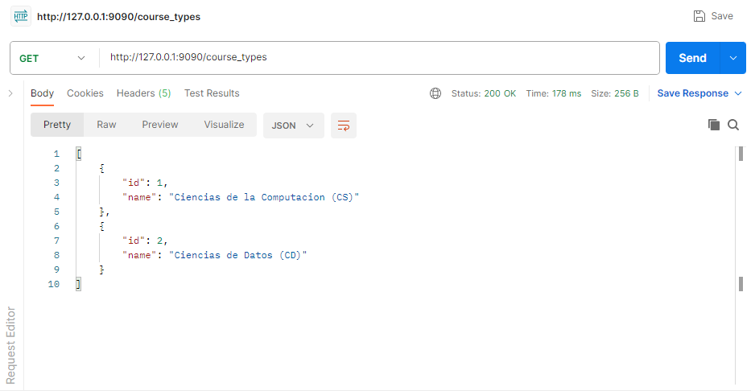

# hackaton2
---
{
    "score" : "15",
    "section" : "A708",
    "sectionGroup": "Grupo 1",
    "courseAssessment":{
        "id":6,
        "periodo":{
            "id":1,
            "name": "2023-2",
            "code": "FundationRosExp"
        },
        "course":{ 
            "id":8, 
            "courseType":{
                "id": 1,
                "name" :"Ciencias"
            },

            "name": "Calculo 1",
            "credits":4,
            "code" : "CC2021",
            "hrGroup":"RosExp",
            "cycle": 1,
            "vrGroup": "1"
        },
        "title":"Prueba de Entrada",
        "tipoNota":"Aprobado",
        "numNota": "20",
        "nomenclatura":"AD"
    },

    "professor":{
        "id":1,
        "name": "Jesus",
        "lastName": "Bellido",
        "email":"jesus.bellido@utec.edu.pe",
        "fullName":"Jesus Bellido"

    },

    "student":{
        "id":1,
        "name": "Gian Marco",
        "email": "gian.arteaga@utec.edu.pe",
        "code": "202120094"
    }
}

---
# Professor

---
http://127.0.0.1:9090/professors
{
    "name": "Jesus",
    "lastName": "Bellido",
    "email":"jesus.bellido@utec.edu.pe",
    "fullName":"Jesus Bellido"
}

---

# Student
---
http://127.0.0.1:9090/students
{
    "name": "Gian Marco",
    "email": "gian.arteaga@utec.edu.pe",
    "code": "202120094"
}

---

# CourseAssessment

---
http://127.0.0.1:9090/course_assessments

{

    "course":{  
    "id": 2,      
    "name": "Ecuaciones Diferenciales",
    "credits":4,
    "code" : "CC2021",
    "hrGroup":"RosExp",
    "cycle": 3,
    "vrGroup": "1",
    "courseType": {
        "id": 3,
        "name" :"Ciencias"
    }

    },

    "periodo":{
        "id":1,
        "code":"FundacionRosExp",
        "name":"2023"
    },
    "title":"Prueba de Entrada",
    "tipoNota":"Aprobado",
    "numNota": "20",
    "nomenclatura":"AD"

}

---
# Periodo
---
http://127.0.0.1:9090/periodos
{    
    "name": "2023-2",
    "code": "FundationRosExp"
}

---

# Course
---
http://127.0.0.1:9090/courses
{    

    "name": "Calculo 1",
    "credits":4,
    "code" : "CC2021",
    "hrGroup":"RosExp",
    "cycle": 1,
    "vrGroup": "1",
    "courseType": {
        "id": 1,
        "name" :"Ciencias"
    }

}

---

# CourseType
---
http://127.0.0.1:9090/course_types
{
    "name": "Ciencias"
}

---

